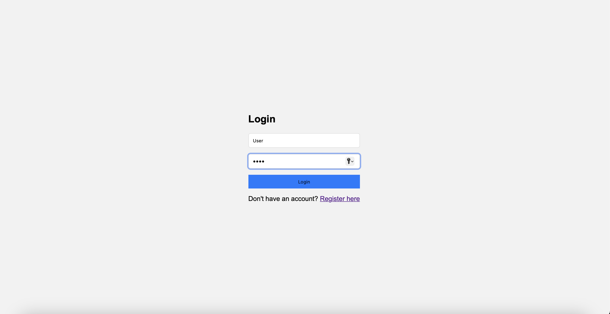
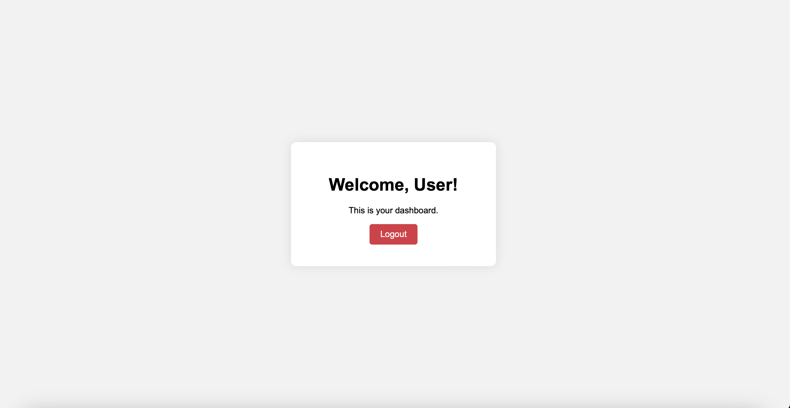

# COP290 Assignment1

## Description
This web application is developed as a part of the COP290 course. It's a Flask-based project designed to manage user registrations and logins, featuring a welcoming interface.

## Installation Instructions

1. **Clone the Repository**


2. **Install Required Packages**
- Make sure Python is installed on your system.
- Install the necessary dependencies:
  ```
  pip install -r requirement.txt
  ```

## Usage

To launch the web application, run:
 
  ```
  python3 app.py
  ```

Upon running the command, the Flask server will start, and the application should be accessible through a web browser at `http://localhost:5000` or the designated port displayed in your terminal.


## Screenshots

### Registration Page


### Login Page


### Dashboard

